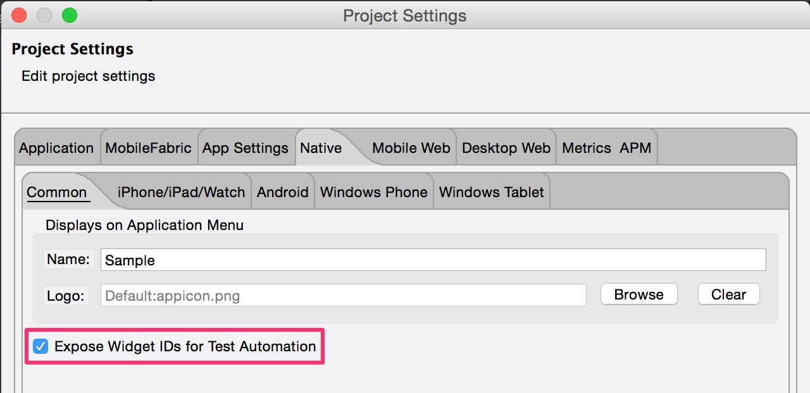
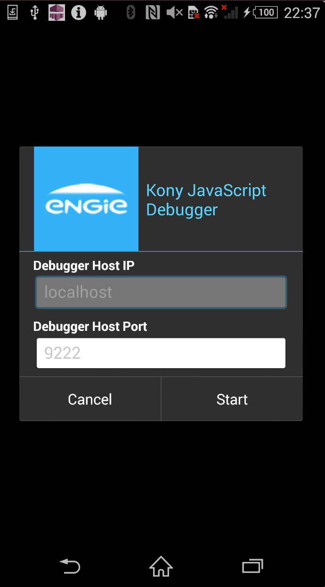
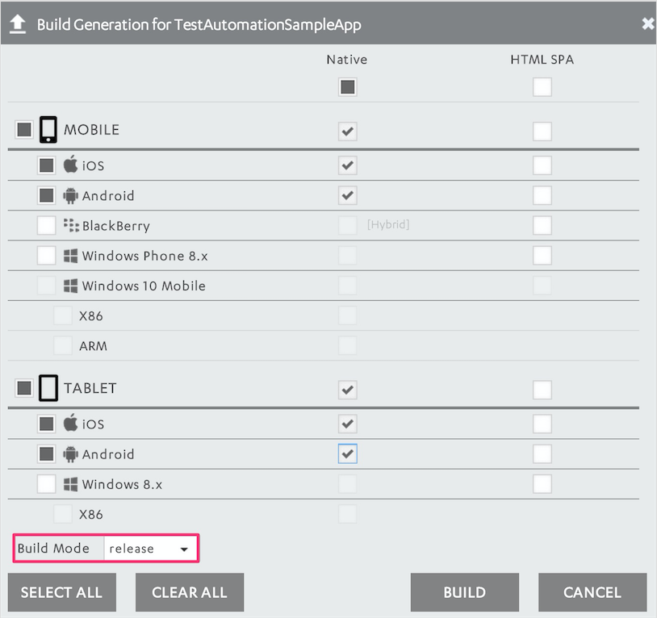

# KitchenSink

This is a small application that showcases some of the most commonly used Kony widgets available from the Visualizer palette, mainly for the purpose of demonstrating how test automation scripts can interact with them and used to test a Kony app.
The test scripts for it can be found here:

[KitchenSinkTests](https://github.tools.digital.engie.com/Kony/KitchenSinkTests)

## Channels Targeted

Select all the platforms targeted for this project.

- Mobile
  - [x] iOS
  - [x] Android
  - [ ] Windows Phone 8.x
- Tablet
  - [ ] iOS
  - [ ] Android
  - [ ] Windows 8.x
- Desktop
  - [ ] Desktop Web
  - [ ] Desktop Windows
- Smart Watch
  - [ ] Apple Watch
  
## Dependencies

None

## Exposing Widget ID's

In order to be able to use TestNG on a Kony app, you must expose the identifiers of the widgets that make up your app's UI before you build it.
To do this go to:

*"Project Settings" > "Native" > "Common"*

And check the box "Expose Widget IDs for Test Automation"

 

## Beware of the Build Mode and the Debugger's Screen

 

It's important to note that when a Kony app is built in **debug** mode the first screen that comes up is the one the debugger's screen.

So if you plan to run your tests scripts on an app built in debug mode, you'll need each test's **@BeforeTest** annotated method to execute the necessary navigations to cancell this screen and and take you to the screen you want to test.

## Build Mode

A simpler course of action to avoid the additional navigation out of the Debugger's screen is to simply build in **release** mode for the purposes of test automation. This way the debugger's screen is not presented and your test's **@BeforeTest** annotated method just has to be resposilble for navigating to the screen you want to test.

 

## Implementation Notes

Built using Visualizer Enterprise 7.3.0
